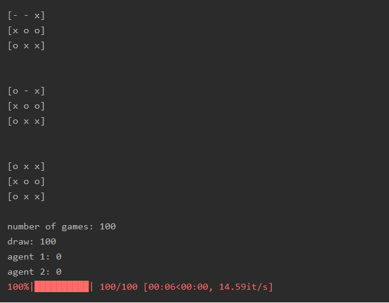

# Reinforcment learning using Monte Carlo Tree Search
A collection of games were agents use the Monte Carlo Tree Search algorithm to play against each other.  Currently only supports Tic Tac Toe. 

## Playing a game of tic tac toe
Two agents play a game by simulating their next move with a UCT (Upper Confidence Bound 1 applied to trees) score. The agents are capable of solving the game and the only winning move is not to play.

### Future development
- Add more games.
- Implement ANNs.